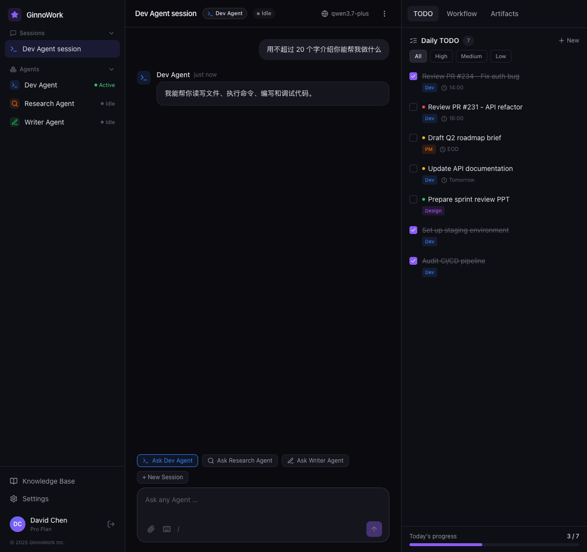
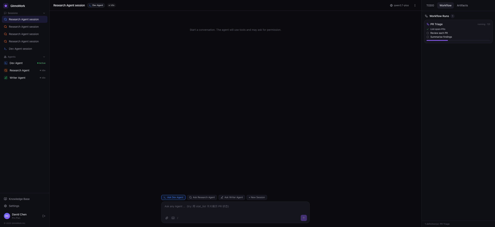
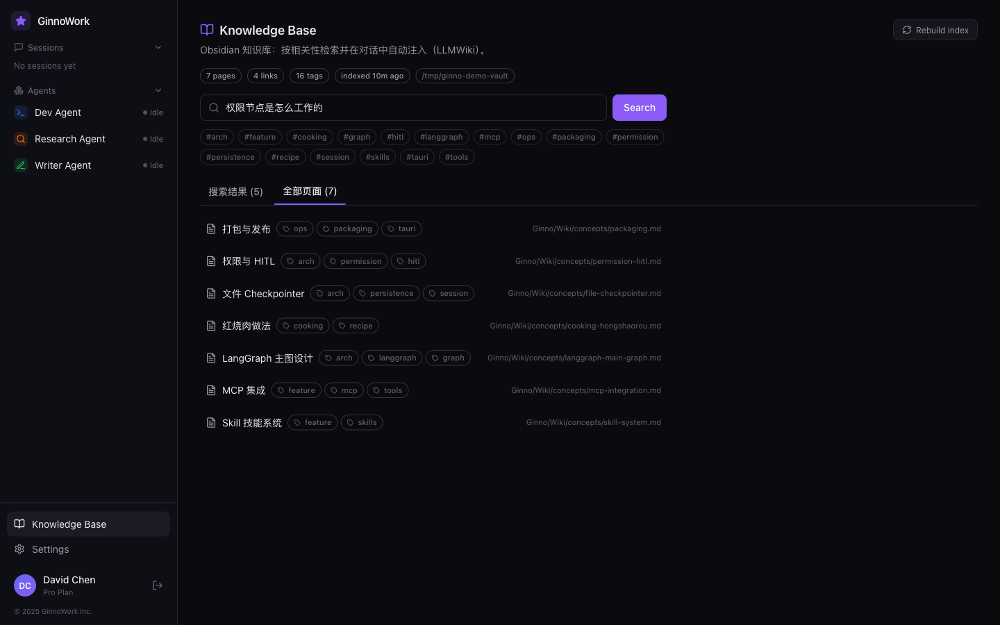

<div align="center">

# Ginno

**A local-first personal AI agent that runs on your own machine.**

*The shape of Claude Code, all-file storage (no DB · no account · no cloud), and a visual Workflow Studio.*

[](LICENSE)
-black.svg)


[English](README.md) · [简体中文](README.zh-CN.md)



</div>

---

## What it is

Ginno turns the capabilities an AI agent should have into a **complete desktop app**,
instead of scattering them across a terminal and a dozen browser tabs.

- 🧠 **Multi-agent chat** — switch agents mid-conversation, shared history, per-agent memory
- 🛠️ **Tools · permissions · skills · MCP · hooks** — Claude Code's shape, all built in
- 🔀 **Visual Workflow Studio** — a versioned DSL you compile into a LangGraph state graph, with a live run observer
- 📚 **Local knowledge base** — index your Obsidian vault; answers come back with citations
- 🎯 **Long-horizon goals + TODO sync** — let the agent keep working toward a standing objective
- 🌐 **Embedded browser + web search** — retrieval with source attribution, not vibes

> Full feature walkthrough: [`docs/user-guide.md`](docs/user-guide.md).

| Workflow Studio | Local knowledge base |
|---|---|
|  |  |

---

## Why "local-first"

One design rule: **your data should not leave your machine.**

| | Ginno |
|---|---|
| Database | ❌ none — all state is JSON / JSONL / Markdown under `~/.ginno/` |
| Account | ❌ none — open it and go |
| Cloud sync | ❌ none — everything stays local |
| Portable | ✅ copy the folder to move it; readable, hand-editable, git-able |

You bring your own model key (OpenAI / Anthropic / DeepSeek, or any compatible endpoint).
**Ginno is just a client — it never takes custody of your key or your data.**

---

## Install

**Option A — download (macOS, Apple Silicon):** grab the latest `.dmg` from
[Releases](https://github.com/robscc/ginno/releases).
It is **not code-signed** yet, so on first launch use **right-click → Open** to get past Gatekeeper.

**Option B — build from source:**

```bash
git clone https://github.com/robscc/ginno
cd ginno

pnpm install                       # web + desktop shell
cd packages/runtime && uv sync     # Python runtime
cd ../..

pnpm dev                           # web + runtime + desktop shell, all at once
```

Requires: Node ≥ 20 · pnpm ≥ 9 · Python ≥ 3.11 (via `uv`) · Rust (Tauri).

**Package a `.app`:** `make app` → `apps/desktop/target/release/bundle/dmg/Ginno_*.dmg`
(see [`docs/p3-packaging-notes.md`](docs/p3-packaging-notes.md)).

---

## Stack

| Layer | Choice |
|---|---|
| Shell | Tauri 2 (Rust) — process management + webview only |
| UI | Next.js 14 (static export) + React 18 + Tailwind |
| Runtime | Python + FastAPI + LangGraph (sidecar, bundled with PyInstaller) |
| Storage | plain files (no DB); optional LanceDB for semantic-search vectors |

> Architecture and subsystem designs: [`docs/architecture.md`](docs/architecture.md).

---

## Status

- A **personal project**, used daily (dogfooding) and iterated fast — ~2.5 months, 220+ commits.
- Early and unpolished; APIs and UI still move.
- Issues, PRs, and ideas are welcome — in English or Chinese.

## License

[MIT](LICENSE) © 2026 ChuanchuanSong