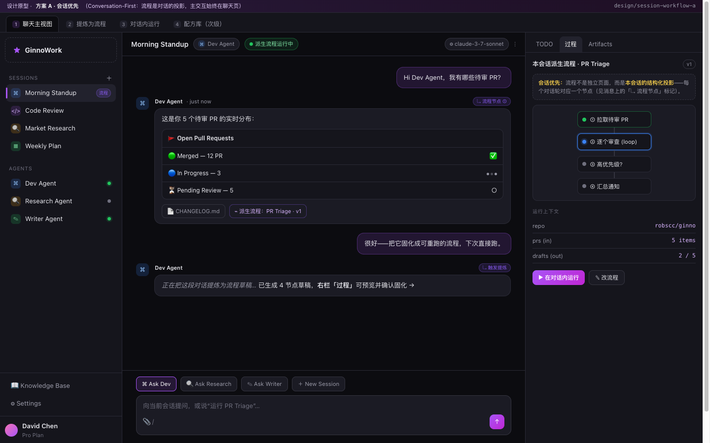
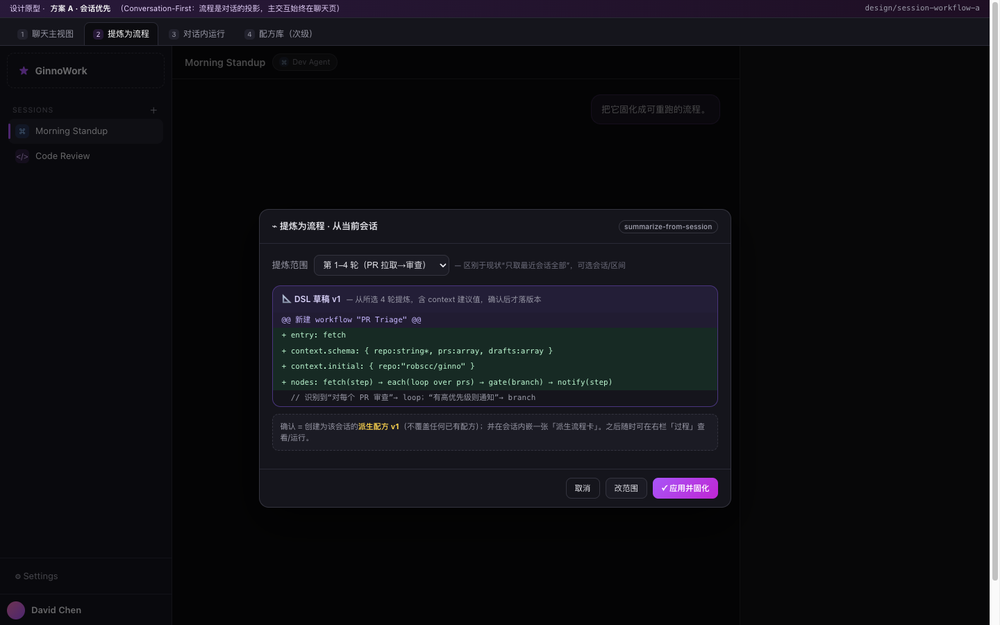
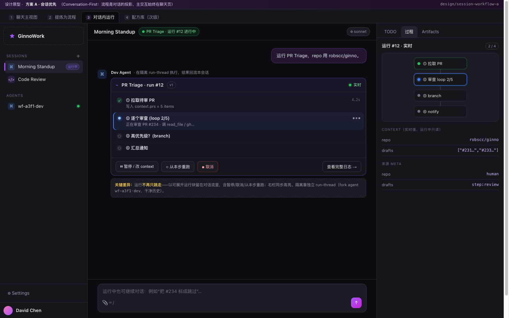
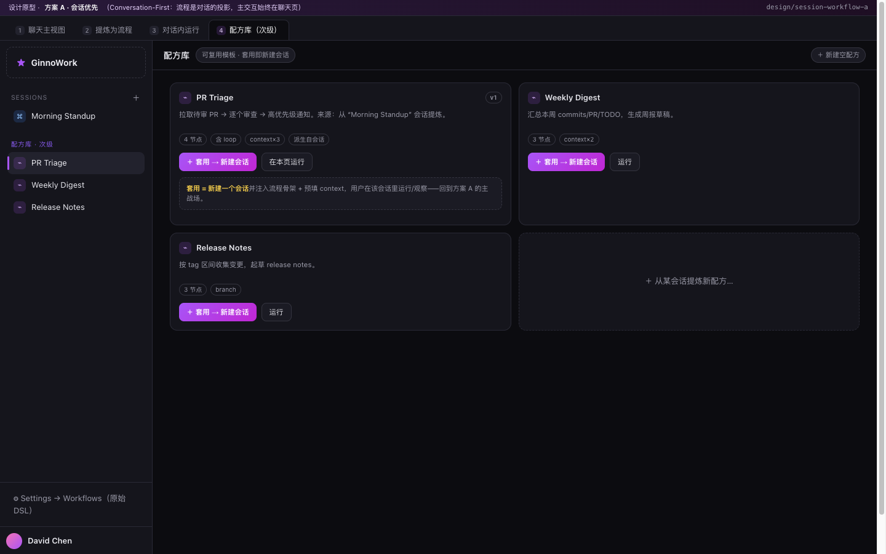

# 方案 A · 会话优先（Conversation-First）

> 分支：`design/session-workflow-a` ｜ 原型：`docs/design/prototypes/a/index.html` ｜ 截图：`docs/design/screenshots/a/`
> 另两个方案：`design/session-workflow-b`（工作室优先）、`design/session-workflow-c`（双模混合）。三者对比见文末 §10，亦见各分支同名章节。

---

## 1. 一句话定位

**会话是一等公民，工作流是会话的「结构化投影 / 可重放脚本」。** 主交互始终在聊天页；workflow 不再拥有与聊天平级的主战场，而是作为「本会话的过程视图」+「可固化复用的派生配方」存在。

- 适用人群：习惯自然对话、把 agent 当协作伙伴的用户；流程是"顺手沉淀"的副产品，而非预先搭建的对象。
- 设计信条：**对话领先，流程跟随**——先聊出结果，再把过程固化；运行时也回到对话里观察，而不是被甩到一个独立页面。

---

## 2. 核心概念模型

```
            ┌──────────────── Session（= thread = checkpointer 文件）────────────────┐
            │  对话时间线（messages/blocks）   ⇄   过程视图（派生配方的 DAG + 节点↔轮次映射） │
            └───────────────┬───────────────────────────────────┬──────────────────────┘
                            │ 提炼（选范围 + diff 确认）          │ 套用（配方→新建会话）
                            ▼                                   ▲
                  ┌── 派生配方（Derived Recipe, 版本化 DSL）──┐
                  │  derived_from_session_id  /  context / trace │
                  └───────────────┬─────────────────────────────┘
                                  │ 运行（隔离 run-thread，结果回流会话）
                                  ▼
                  ┌── Run（present_in_session_id → 在对话内渲染运行块）──┐
                  └──────────────────────────────────────────────────────┘
```

对象关系要点：
- **Session** 仍是用户的主要工作单元；左栏列表不变。
- **Recipe（配方）** 降级为「派生/可复用模板」：要么从某会话提炼而来（带 `derived_from_session_id`），要么被「套用」去新建会话。它不再有独立主页面，入口在左栏次级区 / Settings。
- **Run** 与触发它的会话强绑定（`present_in_session_id`），运行块**留在对话流里**而非只跳走。

---

## 3. 信息架构

| 区域 | 方案 A 的安排 | 与现状差异 |
|---|---|---|
| 左栏 Sessions | 不变；会话项可带「流程 / 运行中」徽标 | + 徽标 |
| 左栏 Agents | 不变（只读在场） | — |
| 左栏 次级「配方库」 | 新增折叠区，列派生/可复用配方；点「套用」= 新建会话 | 现状配方在独立 `/workflows` 页 + Settings |
| 顶栏 | 标题 + Agent + **派生流程运行中**状态 + 模型 | + 运行状态来自绑定的 run |
| 聊天区 | 不变；消息带「↳ 流程节点 N」标记；**运行块内联**（含暂停/取消/从本步重跑） | + 节点标记 + 内联运行块 |
| 右栏 tabs | TODO / **过程** / Artifacts（「过程」取代/增强原 Workflow tab） | 过程 tab 显示**本会话**派生 DAG + 上下文 + 「在对话内运行」 |
| 独立 `/workflows` 页 | 取消主入口，降级为 Settings→Workflows（原始 DSL 兜底） | 现状是主页面 |

---

## 4. 关键交互（逐屏，配截图）

### 屏 1 · 聊天主视图 `a_a1.png`

- 每条产生结构化产出的 agent 气泡右上有 **「↳ 流程节点 ①」** 标记：hover 说明"该轮对话对应派生流程的某节点"，点击在右栏 DAG 高亮该节点。
- 气泡下方 refs 出现 **「⌁ 派生流程：PR Triage · v1」** chip，表示本会话已固化出派生配方。
- 右栏「过程」tab：本会话派生 DAG（只读，按对话进度着色）+ 运行上下文 + **「▶ 在对话内运行」**。
- 价值：**流程不是被打开的页面，而是对话的另一个视角**，用户无需切换心智。

### 屏 2 · 提炼为流程 `a_a2.png`

- 触发：用户说"把它固化成流程" / 右栏「提炼为流程」。
- 弹层三要素：**① 提炼范围**（全部 / 选定轮次区间 / 手动框选）——修复现状"只取 `sessions[0]` 全部"；**② DSL 草稿预览**（含 `context` 建议值、识别出的 loop/branch）；**③ diff 确认卡**（复用 violet 卡形态，但走独立 confirm 通道，见 §6）。
- 确认 = 创建派生配方 v1（`derived_from_session_id` 指向本会话），并在会话内嵌派生卡。**不覆盖**任何已有配方。

### 屏 3 · 对话内运行 `a_a3.png`

- 在会话里点「运行」→ 运行块**就地展开**：实时步骤（done/running/wait）、当前 loop 进度、每步耗时。
- 运行块底部控制：**⏸ 暂停/改 context · ⟲ 从本步重跑 · ■ 取消 · 查看完整日志**。
- 隔离机制不变（独立 run-thread + fork agent `wf-xxxx·dev`，干净历史），但**呈现回到本会话**；右栏同步高亮 + 实时 context（含来源 meta：`human` / `step:review`）。
- 运行中仍可继续对话（如"把 #234 标成跳过"→ 转为 human resume 的 context_patch）。

### 屏 4 · 配方库（次级）`a_a4.png`

- 左栏次级区/Settings 列可复用配方；每卡显示节点数/是否含 loop/context 字段/来源（派生自某会话）。
- **「＋ 套用 → 新建会话」**：新建会话并注入流程骨架 + 预填 context，用户在该会话运行/观察——回到主战场。
- 也保留「在本页运行」给不想开会话的轻量场景。

---

## 5. 多轮模拟（端到端 user story：PR 晨会 → 固化 → 复用）

| 轮 | 用户动作 | 系统响应 | 对应屏 |
|---|---|---|---|
| 1 | 在 "Morning Standup" 会话问"我有哪些待审 PR？" | Dev Agent 调工具，回 PR 分布卡 | a1 |
| 2 | "把它固化成可重跑的流程" | 弹「提炼为流程」，默认范围=相关轮次，预览 4 节点 DSL | a2 |
| 3 | 改范围为"第 1–4 轮"，点「应用并固化」 | 创建派生配方 v1；会话内嵌派生卡；右栏「过程」出现 DAG | a1 |
| 4 | 右栏点「▶ 在对话内运行」，context.repo 已预填 | 运行块就地展开，节点①done、②running | a3 |
| 5 | 运行中发"把 #234 跳过" | 触发 human resume + context_patch，loop 跳过该项 | a3 |
| 6 | 运行完成 | 运行块折叠为结果摘要；右栏 DAG 全绿 | a1 |
| 7 | 次日，左栏配方库对 "PR Triage" 点「套用→新建会话」 | 新建会话，骨架+context 预填，直接运行 | a4→a3 |

---

## 6. 技术方案

### 6.1 数据模型变更
- `WorkflowDef`/版本快照：增 `derived_from_session_id?`、`trace?: [{turn_index|message_id, node_id}]`（轮次↔节点映射，用于屏 1 标记）。
- `SessionMeta`（`_index.json`）：增 `derived_workflow_id?`（本会话当前派生配方）。
- `WorkflowRun`：`session_id` 真正写入（现状 `create_run(session_id=None)` 未传）；增 `present_in_session_id`（在哪个会话渲染运行块，通常=触发会话）。

### 6.2 API 变更（基于现状端点）
| 端点 | 变更 | 目的 |
|---|---|---|
| `POST /api/workflows/summarize-from-session` | body 增 `range?:[from,to]`；**默认只返回草稿不建版本** | 屏 2 选范围 + diff 确认（修复"只取 sessions[0] 且直接建 v1"） |
| `POST /api/workflows`（create） | 接受 `derived_from_session_id`、`dsl`、`trace` | 确认后落 v1 并记派生来源 |
| `POST /api/workflow_runs` | body 增 `session_id`、`present_in_session_id`，持久化 | 修复弱关联，支撑内联运行块 |
| `POST /api/workflow_runs/{id}/cancel` | **新增** | 屏 3 取消 |
| `POST /api/workflow_runs/{id}/resume` | **新增** `{context_patch?}` | human 节点 / 暂停恢复 + 运行中改 context |
| `POST /api/workflow_runs/{id}/rerun_from` | **新增** `{node_id, context_patch?}`（v1 可降级为"带 context 重启"） | 屏 3 从本步重跑 |
| `GET /api/workflows` | 视图带 `derived_from_session_id` | 配方库展示来源 |

### 6.3 WS 事件（最大基建项：把轮询改推送 + 解耦 confirm 通道）
现状：UI 对 run 每 1.5s 轮询 `/workflow_runs/{id}/events`；session socket 仅发 `workflow.emit`/`workflows.changed`；diff 确认复用 `permission_response`。方案 A 改动：
- **新增 session socket 事件**：`run.bind {run_id, present_in_session_id}`、`run.event {run_id, event}`、`run.status {run_id, status, steps}`。server 在 `_run_workflow_bg` 里把 engine 事件**扇出**到该 run 绑定的会话 socket（按 `present_in_session_id` 查在线 socket）。→ ChatStream 收到 `run.bind` 即在对应会话插入运行块，收 `run.event/status` 实时更新，**取消轮询**。
- **解耦 confirm 通道**（呼应设计稿 Q9）：新增入站消息 `version_response {propose_id, decision}` 与 `run_control {run_id, action, payload}`；`permission_response` 仅留权限用途，避免随权限子系统移除而丢失 diff/运行控制。

### 6.4 Run 状态机
`created → running ⇄ paused → {done | failed | cancelled}`。`paused` 覆盖 human 节点 interrupt 与手动暂停；`resume` 走 checkpointer `Command(resume=…)`（现状 engine 对 orphan interrupt 直接 abort，需改为可恢复）。

### 6.5 与现有代码衔接表
| 文件 | 改动 |
|---|---|
| `server.py` | summarize 增 range/不自动建版；runs 增 session/present + cancel/resume/rerun；`_run_workflow_bg` 扇出 run.* 到会话 socket；新增 `version_response`/`run_control` 入站分支 |
| `workflows/store.py` | run 写 session_id/present；版本记 derived_from/trace；原子写沿用 |
| `workflows/engine.py` | 支持 human interrupt 可恢复 + cancel 信号 + rerun_from（v1 降级实现） |
| `tools/workflow_tools.py` | `workflow_run` 传入当前 session_id（现状没传，靠正则匹配 run_id 的 hack 可移除） |
| `apps/web ChatStream.tsx` | 处理 run.bind/run.event/run.status 渲染内联运行块；per-turn 节点标记（读 history+trace）；停掉该 run 的轮询 |
| `apps/web blocks.tsx` | WorkflowBlock 改为按 present 会话滚动定位，不再跳 `/workflows` 根 |
| `apps/web WorkflowInspector/Panel` | 新增「提炼范围+确认」弹层；右栏「过程」tab 接 run 推送 |
| `apps/web runtime.ts` | 补 cancel/resume/rerun/summarize(range)；WS 新事件类型 |
| `apps/web workflows/page.tsx` | 降级/移除主入口，逻辑迁到左栏配方库 + Settings |

### 6.6 迁移策略
- 新字段全部 optional，旧数据 backfill 为 null；旧 `/workflows` 页保留一个版本作为兜底再删。
- 现状"summarize 直接建 v1"加 feature flag，UI 切到确认流；旧自动建版路径灰度下线。
- WS 新事件为增量，旧客户端忽略即可；轮询路径保留一个版本作为 fallback（推送未达时降级）。

---

## 7. 权衡

| 维度 | 评价 |
|---|---|
| 优势 | 学习成本最低；最大化复用现有聊天 UI；"聊着就把流程沉淀了"非常自然；运行可观察/可干预回到对话，闭环完整 |
| 劣势 | 重流程/无头运行（如定时跑 PR Triage）缺少专属控制台；配方跨会话复用是二等公民；长会话里内联运行块可能冗长 |
| 风险 | run 事件扇入会话 socket 的扇出与背压（多 run/多端在线）；per-turn↔node 的 trace 质量依赖 LLM 提炼，需可手改 |
| 实现成本 | **中**：主要是 WS 推送 + run 控制 + 确认流 + 内联运行块；**新建页面少**（比 B 省一整个 Studio） |
| 对现有代码侵入 | 中：server WS 与 engine 改动较多，但前端多为增强而非重写 |

---

## 8. 分阶段落地
- **P1**：derived 关联 + 范围化 summarize + diff 确认流（不动 run）。让"提炼"可控、可确认。
- **P2**：`run.bind/run.event/run.status` 推送 + 内联运行块 + cancel。运行回到对话。
- **P3**：human resume + context_patch + per-turn 节点标记。运行可干预、对话↔节点可映射。
- **P4**：配方库「套用→新建会话」+ rerun_from。复用与重跑闭环。

---

## 8.5 Supervisor 设计（第二轮补充）

> 原型：`docs/design/prototypes/a/supervisor.html` ｜ 截图：`screenshots/a/a_sup_a5.png`（human）、`a_sup_a6.png`（auto）。

**统一概念**（三方案共用）：Supervisor 是挂在执行上的治理层，在检查点（每步后 / 指定节点 / 出错时）发出控制决策：`继续 / 重试本步 / 跳过 / 改context / 暂停 / 中止`。**auto**=独立 LLM 按策略+预算结构化裁决（默认"仅异常时干预"，pass-through 不刷屏；不确定/超预算**回退 human**）；**human**=检查点 interrupt 推裁决卡。安全阀：每步 retry_limit、单 run 干预上限、token 预算。配置三层：配方 DSL 默认 → 运行前 override → 运行中切模式。

**方案 A 的落点（会话优先）**：
- **human 裁决卡留在对话流里**，与运行块一体（`a_sup_a5`）：六键（继续/重试/跳过/改context/保持暂停/中止），不跳页；决策经 `run_control/decide` 回传并记 `supervisor_decision` 事件。
- **auto 呈现为小字注释**（`a_sup_a6`）：常规 pass-through 折叠，仅"干预/回退 human"高亮；右栏 **Supervisor tab** 给可审计监督日志（reason/预算/置信度）。
- 右栏「过程/Supervisor」承载**三层配置**：模式段控（auto⇄human 运行中即时切换）、检查点、retry 上限、策略文本。
- 与 A 信条一致：监督不打断"对话为主"——auto 静默自愈，human 才浮到对话里。

**技术增量**（与 §6 叠加）：DSL `supervisor` 扩展 `{enabled,mode,checkpoints,retry_limit,strategy,model?}`；compiler 在检查点插 supervisor 节点（现状为桩）；engine 实装 auto 结构化裁决 + human interrupt 可恢复 + 应用决策（retry 回边计数/skip 走下一节点/patch 合并 context/abort→END）；WS `supervisor.event/decision/pending`；REST `POST /workflow_runs/{id}/decide`、`PUT /workflows/{id}/supervisor`、run 创建 `supervisor_override`。事件落 `events.jsonl` 可过滤。

**落地相位**：并入原 P3（human resume）后加 P3.5：auto 裁决 + 监督日志 + 三层配置 UI。

---

## 9. 开放问题
- Q-A1：一个会话是否允许多个派生配方？倾向"一个 current + 历史版本"，避免右栏歧义。
- Q-A2：无头/定时运行在 A 里放哪？倾向仍生成一个"运行会话"承载运行块（与 C 的 run-scoped session 思路合流）。
- Q-A3：trace 手改入口放在「过程」tab 还是提炼弹层？倾向提炼弹层给初值 + 过程 tab 可微调。

---

## 10. 三方案对比（同表见 B/C 分支）

| 维度 | A 会话优先 | B 工作室优先 | C 双模混合 |
|---|---|---|---|
| 主交互入口 | 聊天页 | Workflow Studio 页 | 统一「任务」列表 |
| 会话↔流程关系 | 流程=会话的投影 | 会话服务于流程（开发/观察） | 同对象的两种视图，双向同步 |
| 学习成本 | 低 | 中-高 | 中 |
| 轻对话用户 | ★★★★★ | ★★ | ★★★★ |
| 重流程/无头用户 | ★★ | ★★★★★ | ★★★★ |
| 配方跨会话复用 | 二等（套用） | 一等 | 一等（蓝图↔实例） |
| 实现成本 | 中 | 高 | 中-高 |
| 对现有代码侵入 | 中（WS/engine 多） | 高（新 Studio + 页面） | 高（统一对象模型重构） |
| 主要风险 | 长会话冗长 / 无头弱 | 对话体验被边缘化 | 概念统一难、映射易错 |
| 一句话 | 聊着沉淀，跑回对话 | 像 n8n/Dify 搭流程 | 一个任务，对话/流程随便切 |

**推荐场景**：若产品主叙事是"个人 AI 协作伙伴、对话为主"，选 **A**；若主打"可复用自动化流水线"，选 **B**；若想两者通吃且愿承担模型重构，选 **C**。

---

## 11. 实现落地（round 3 · 已提交于本分支 `design/session-workflow-a`）

按"节点可复用/可插件化、带类型、参数校验、边 transform、参数不满足时 Supervisor 介入、内置通用 Agent 节点"的要求，已在 `packages/runtime` 实现并测试（**未动 main**）：

**新增**（`workflows/nodes/` + `workflows/supervisor.py`）：
- `nodes/base.py` `BaseNode`：`type/aliases` + `params_schema/inputs_schema/outputs_schema` + `validate_params/validate_input/coerce_input`；通用 `make_node` 包装＝输入解析→参数/输入校验→**Supervisor 介入**→`execute`→输出记录→**边 transform 传播**；`add_edges` 自布线。
- `nodes/registry.py`：`@register_node`/`get_node`/别名/`load_plugins`（entry-points 组 `ginno_runtime.workflow_nodes` + `GINNO_NODE_PLUGINS`）。**新增节点＝写一个类＋装饰器，核心零改动**（解耦）。
- `nodes/transforms.py`：边 `transform`（`map`/`expr`/`pick`/`defaults`/`fn` 注册）；默认＝上下文+上游输出浅合并。
- `nodes/builtin.py`：内置通用节点 `agent`(别名`step`)/`llm`/`branch`/`loop`/`human`/`pass`。
- `supervisor.py`：参数/输入不满足时 `intervene`；默认 decider＝强转/补默认（coerce）否则 abort；可 `set_decider` 注入 LLM/策略 decider 返回 `patch_dsl/patch_node/retry/skip/abort`（即"由 supervisor 决定改 DSL 或改节点逻辑"）；全程记 `supervisor_intervene` 事件。

**重构**：`compiler.py` 委托注册表构建节点+边、`WorkflowState` 增 `inputs/outputs` 通道；`dsl.py` `validate_dsl` 委托按节点参数校验（保持既有错误文案）+ 边 transform 校验；`engine.py` 初始状态补 `inputs/outputs`。既有契约（`compile_workflow`/`run_workflow`/事件种类）不变。

**完整性校验**：新增 `tests/unit/test_nodes_{registry,transform,supervisor}.py`；`pytest -m unit` **274 过**、workflow API 集成 **8 过**，全绿。
